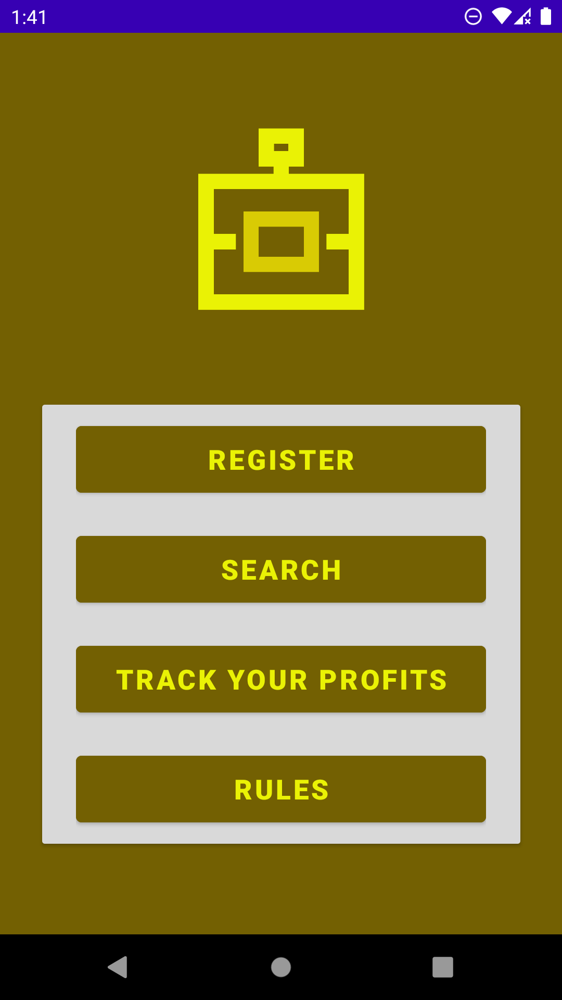
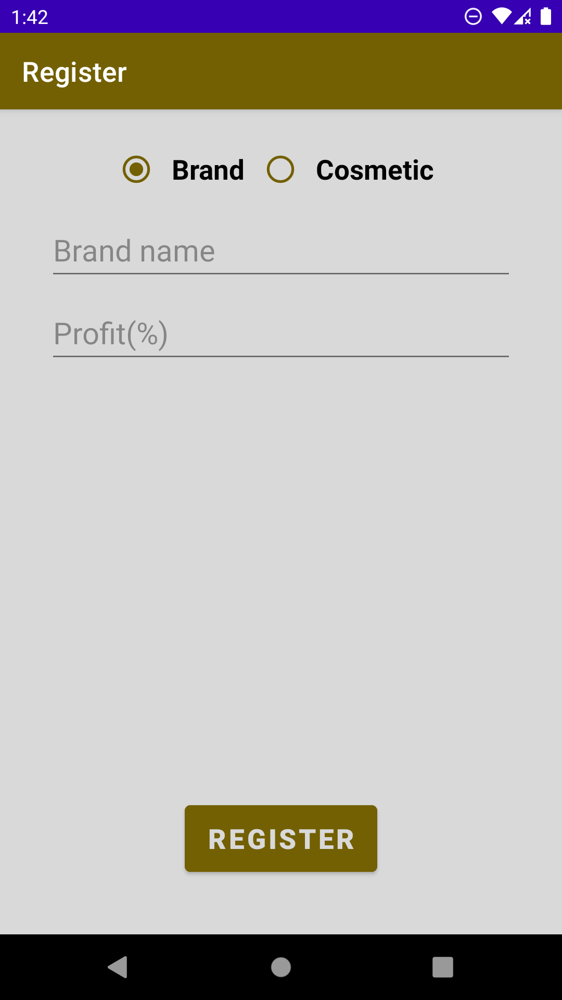
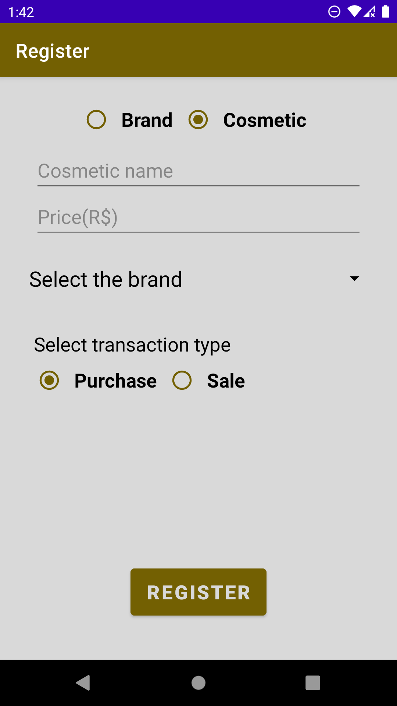
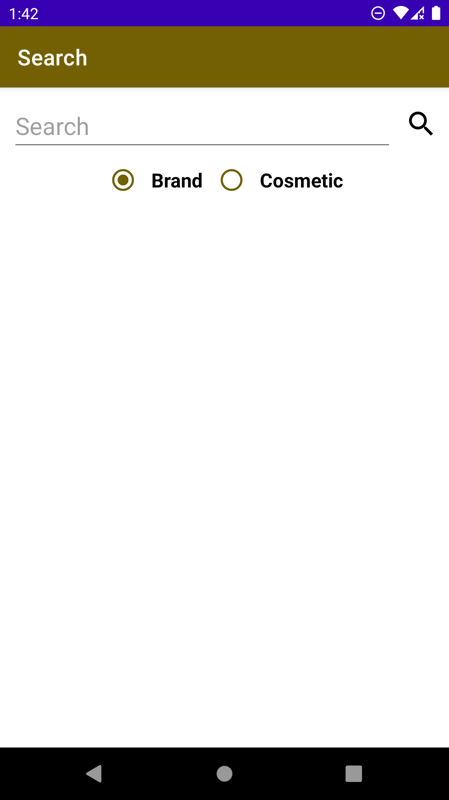
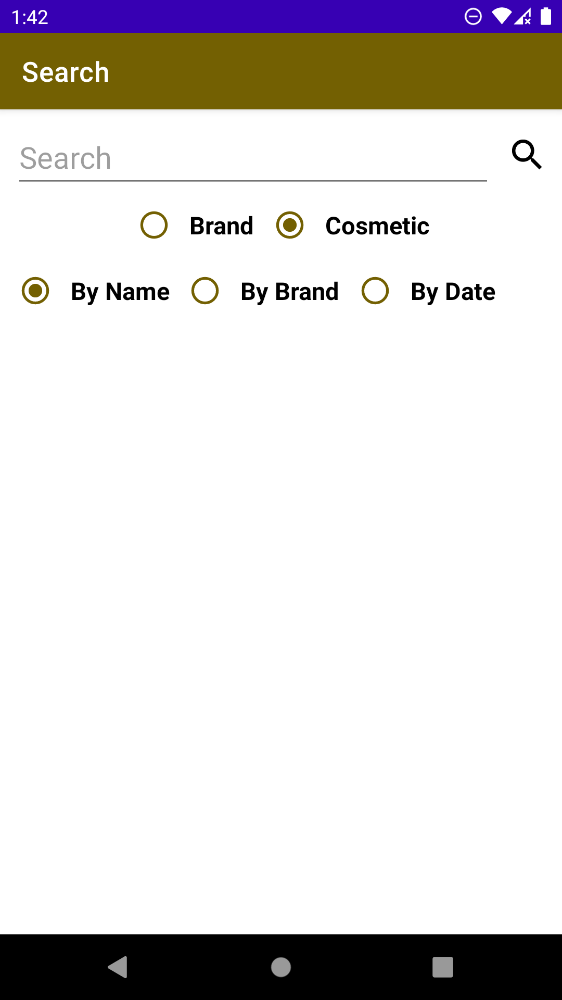
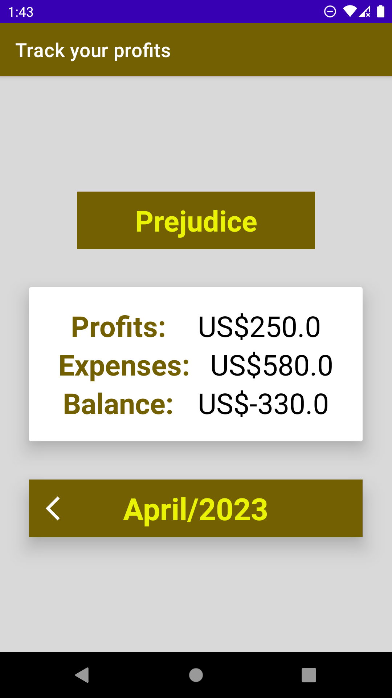
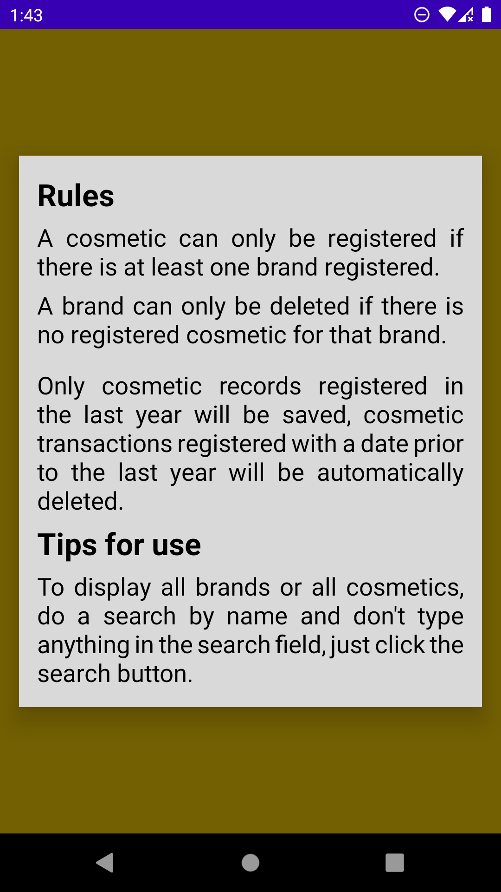
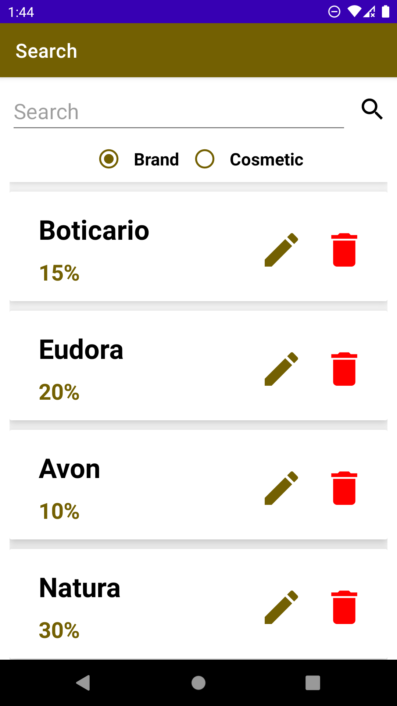
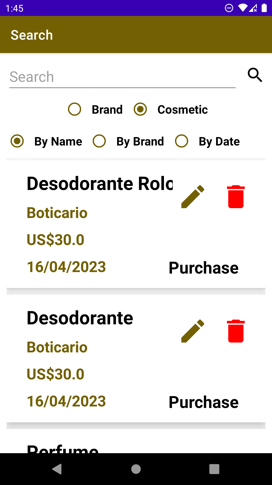

<a href="README.md" target="_blank">Read this page in english</a>

# Gestor de Perfumaria

### O aplicativo permite cadastrar marcas e transações de cosméticos (compra para reposição de estoque ou vendas), além disso permite exibir todas as marcas, todos os cosméticos, bem como, a edição deles. O usuário também pode acompanhar o lucro dos últimos 12 meses com base nas transações cadastradas.

### Regras de negócio:

### Uma marca só pode ser deletada, se não houver nenhuma transação cadastrada com a determinada marca.

### Um cosmético só pode ser cadastrado se houver pelo menos uma marca cadastrada para que seja selecionada.

### As dicas de uso são mostradas em janelas de diálogo e também existe uma tela só mostrando essas regras e as dicas de uso.

#### Tecnologias usadas: 
 

#### Baixe o aplicativo: [Gestor de Perfumaria](https://github.com/AllanBismarck123/Gestor-de-Perfumaria/raw/main/gestor-de-perfumaria.apk)

#### Telas do aplicativo:
        
